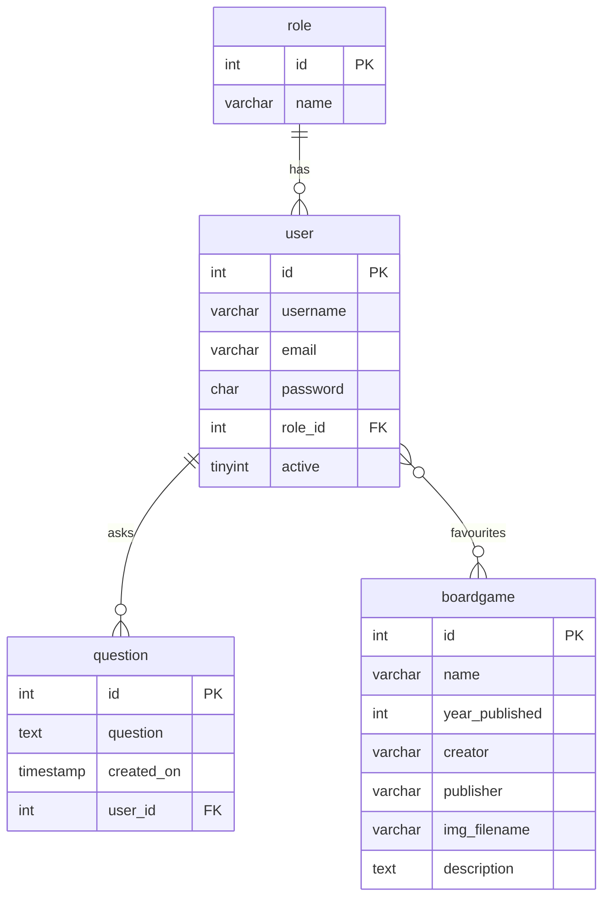

# Mermaid-Diagram for IBDb

Dette er et mermaid-diagram laget ved hjelp av Anthropics KI-modell *Claude*. Jeg planla originalt å tegne den selv, men fikk tekniske problemer med applikasjonen jeg valgte. Mermaid-diagrammet ser slik ut:

