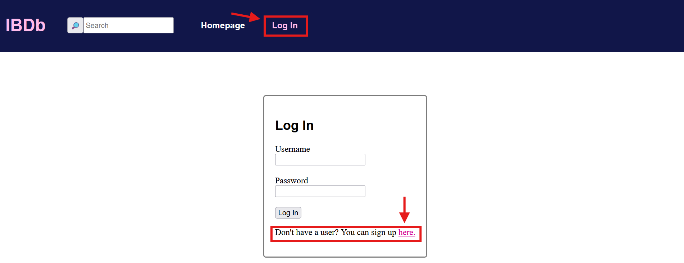
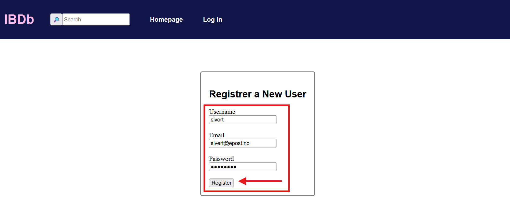

# Brukerveiledning for Nettside -- Internet Boardgame Database

Dette er en veiledning på hvordan å bruke ulike funksjoner på IBDb-nettsiden.

## 1. Opprette Bruker

En viktig del av appen er innloggingen, og for å logge inn må du først ha en bruker. Naviger til "Log In" og trykk på lenken som tar deg til brukerregistrering:

Når du har kommet til registreringen, skriver du inn brukernavn, epost og passord. Her er et eksempel for en bruker med brukernavn "sivert":

Du skal nå få en melding om brukeren ble opprettet, da har du klart å registrert en bruker.
